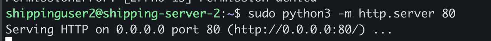
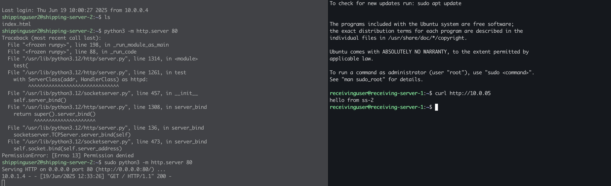

# Problem statement

Two VM can talk to each other inside the same VNet by default. All ports are open by default.

# setup
## VNet (shipping vnet)
1. create a vnet (10.0.0.0/16)
2. create a subnet (10.0.0.0/24)

## VM -1
1. create a VM  (shipping server-1)
2. Enable public IP
3. Enable inbound port 22 (SSH)
4. Enable inbound port 80 (HTTP)
5. Enable inbound port 443 (HTTPS)

## VM -2
1. create a VM (shipping server-2)
2. Disable public IP
3. Disable inbound port 22 (SSH)
4. Enable inbound port 80 (HTTP)
5. Enable inbound port 443 (HTTPS)

# Test
1. SSH to VM-1 using public IP
2. Create a index.html
3. python3 -m http.server 80
4. Open browser and access VM-1 public IP

How to start in server in vm2 ? Public IP is not available.

1. SSH to VM-1 using public IP
2. SSH to VM-2 using private IP
3. Create a index.html
4. python3 -m http.server 80

5. ssh to VM-1 back
6. curl http://10.0.0.5 (private ip of vm2)

# problem statement 2

Two vm on different subnet can talk to each other by default. All ports are open by default.

# setup
## subnet-2
1. create a subnet (10.0.1.0/24)

## VM-3
1. create a VM (receiving server-1)
2. Enable public IP
3. Enable inbound port 22 (SSH)

# Test
1. SSH to VM-3 using public IP
2. curl http://10.0.0.5 # private ip of vm2

