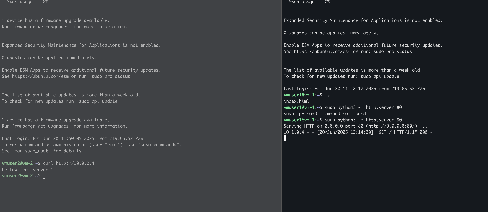

# Problem statement
Two VMs in different Vnets can't talk to each other by default. Need to enable VNet peering to allow communication between them.

## setup
1. create a vnet-1 (10.0.0.0/16)
2. create a subnet-1 (10.0.0.0/24)
3. create a vm-1 
    - Enable public IP
    - Enable inbound port 22 (SSH)
    - Enable inbound port 80 (HTTP)
4. create a vnet-2 (10.1.0.0/16)
5. create a subnet-1 (10.1.0.0/24)
6. create a vm-2
    - Enable public IP
    - Enable inbound port 22 (SSH)
    - Enable inbound port 80 (HTTP)

## Test
1. SSH to vm-1 using public IP
2. Create a index.html
3. python3 -m http.server 80

4. ssh to vm-2 using public IP
6. try to curl http://10.0.0.4 (private ip of vm-1)
7. It will fail with connection refused error.

8. setup vnet peering between vnet-1 and vnet-2
   - Go to vnet-1 -> Peerings -> Add
   - Select vnet-2 and enable allow forwarded traffic

 9. Now try to curl http://10.0.0.4 (private ip of vm-1)
 10. It will succeed.

 