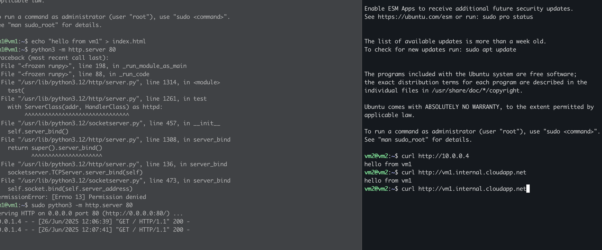
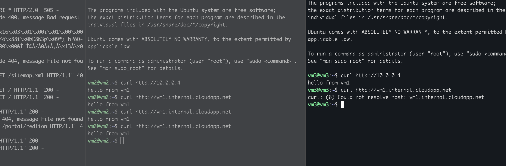
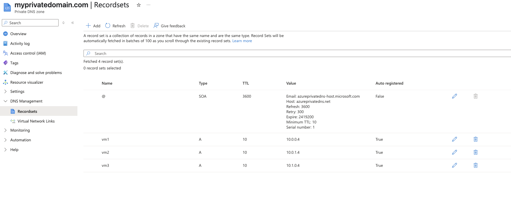
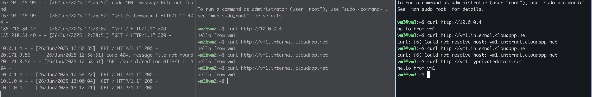
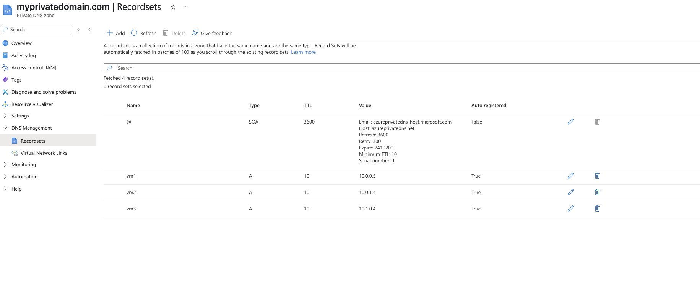
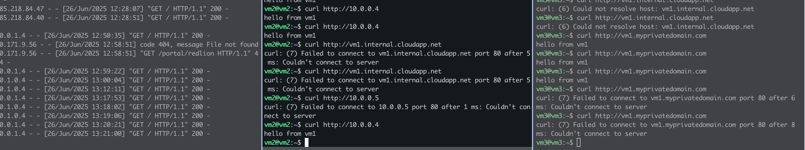
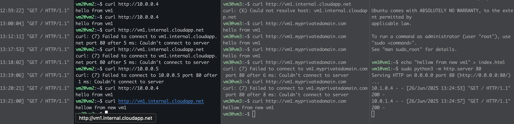

# Problem Statement
Two VMs should be able to communicate with each other using private DNS names in same vnet. Two should be able to communicate with each other using private DNS names in different vnet.

# steps
1. set up a vNet (10.0.0.0/16)
2. Create two subnets ,subnet-1 (10.0.0.0/24) and subnet-2 (10.0.1.0/24)
3. Create two VMs(vm1,vm2) in those subnets
   - Enable public IP
   - Enable inbound port 22 (SSH)
   - Enable inbound port 80 (HTTP)
4. set a vnet-2 (10.1.0.0/16)
5. Create a subnet in vnet-2 (10.1.0.0/24
6. Create a VM (vm3) in vnet-2
   - Enable public IP
   - Enable inbound port 22 (SSH)
   - Enable inbound port 80 (HTTP)
7. Create a peering between vnet-1 and vnet-2
   - Allow forwarded traffic

## Test
1. SSH to vm-1 using public IP
2. Create a index.html
3. `python3 -m http.server 80`
4. SSH to vm-2 using public IP
5. Try to `curl http://vm1.internal.cloudapp.net`

Note: Azure defaults to using private DNS names for VMs in the same vNet, so you can use the VM name directly.
https://learn.microsoft.com/en-us/azure/virtual-network/virtual-networks-name-resolution-for-vms-and-role-instances?tabs=redhat#azure-provided-name-resolution

1. SSH to vm-3 using public IP
2. Try to `curl http://vm1.internal.cloudapp.net`
3. we will get an error because vm1 and vm3 are in different vnet and we have not set up private DNS for that.

## setup
1. craete a priavte DNS zone (myprivateddomain.com)
2. setup vnet link for vnet-1 and vnet-2
3. enable auto registration for vnet-1 and vnet-2

Log

## EXtra

what if i create another vm with same name vm1 in another resource group in same vnet vnet1?  Both private dns and deafult azure dns will resolve to the new vm1.(10.0.0.5)

after start server in new vm1

conclusion: Azure DNS will resolve to the new vm1, not the old one. So, if you want to use private DNS names, you should use unique names for your VMs.